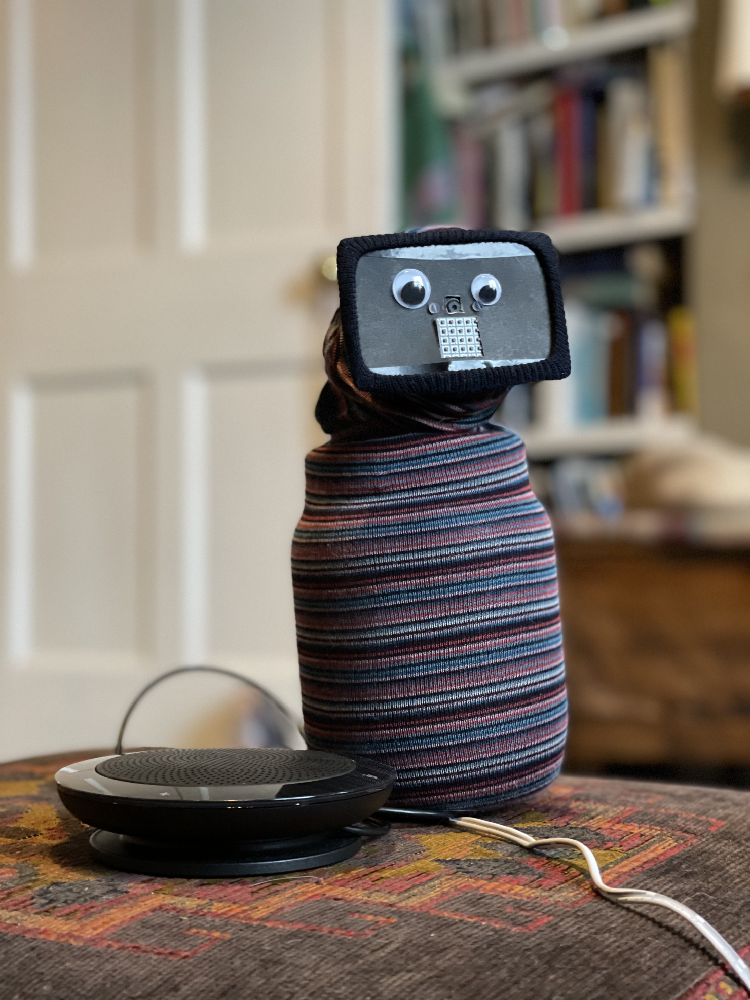

# Introduction

This is a presence robot - the idea is you can "be" somewhere remote, and listen, talk and optionally see what's going on in the remote location.

You need a person in the remote location to plug it in for you. Then you get a notification with a unique URL for you to join via a browser on a laptop or phone. Once there you can move the camera and change "your" expression.

It's basically a Pi 3 in a box with "speakerphone" (a combined speaker-mic).

You should be able to make this in an hour or so. There's minimal soldering, but you do need to do a little bit (I think the 5 x 5 led matrix is really important to indicate there's someone "in" the bot).

You need to be able to use node and have a server to put this on (if you know me, ask and you can borrow mine for a bit and so skip this part).

The steps are:

 * First, create a server.

 * Second, get the Pi part working and test.

 * Third, use the instructions below to customise your bot and make it look cool.

# Decisions

There are a couple of designs described here, but you could make your own of course. Key decision is whether you want your bot to be able to see or whether just beaing able to hear and speak is enough. "Rabbit" is audio only, and "Sock creature" can see one end. To make it cheaper and easier to make, your face is never shown on the bot, but you can pull simple faces via the led matrix.

# You will need:

A server
 * access to a server that can run node, configurable to use https (instructions below)

Pi stuff
 * a [Pi 3 B plus](https://shop.pimoroni.com/products/raspberry-pi-3-b-plus) (£34), [Micro SD card](https://shop.pimoroni.com/products/noobs-32gb-microsd-card-3-1?variant=31703694245971) (8GB or more, £9), a power supply (ideally [an official Pi one](https://shop.pimoroni.com/products/raspberry-pi-universal-power-supply), £8)
 * [female-female jumper cable](https://shop.pimoroni.com/products/jumper-jerky-junior?variant=1076482185) (£3)
 * [a pan-tilt hat](https://shop.pimoroni.com/products/pan-tilt-hat?variant=22408353287) (£34) - for the rabbit you only need 2 x [small servos](https://thepihut.com/collections/all/products/micro-servo) and [the hat](https://shop.pimoroni.com/products/pan-tilt-hat?variant=33704345034) which could be cheaper
 * [a 5 x 5 led matrix](https://shop.pimoroni.com/products/5x5-rgb-matrix-breakout) (£9)
 * [a pi camera](https://shop.pimoroni.com/products/raspberry-pi-camera-module-v2-1-with-mount?variant=19833929735) (£24) (?longer cable?)
 * a USB A speaker Mic (£50-150) - These can be expensive because they are businessy, but they are much the best thing to use. [Sennheiser SP20](https://www.onedirect.co.uk/sennheiser/sennheiser-sp-20-ml-portable-speakerphone) is the best I've used (currebntly £100-odd), [Jabra 410 works](https://www.amazon.co.uk/Jabra-SPEAK-Portable-speakerphone-7410-109/dp/B007SHJIO2), though I've had power problems with my Jabra in the past. You don't need bluetooth (Bluetooth can be difficult on the Pi). Kaysuda and others do ones around £50 - I'm currently testing these. It needs to be a *speaker-mic* (termed 'speakerphone') not a condensing mic which sometimes look similar. 

Decorations
 * a good pot to put it in. I used [a Sunpet 1000ml sweet jar like this one](http://www.alsafifalcongroup.com/images/sunpet-big-9.jpg) which i got from a our local hardware store for 89p. This [Systema jar is also be a good fit](https://sistemaplastics.com/products/klip-it-utility/900ml-cracker). Plastic is better than metal I think, on the grounds that unexpected shorts are less probable with plastic.
 * the important thing is that you can get the Pi 3 with the power supply and usb speaker connected into the top. ??Width??
 
Sock creature:
 * a sock, I used one of [these](https://www.marksandspencer.com/modal-pima-cotton-fine-striped-socks/p/clp60287370?color=BLACKMIX#intid=prodColourId-60287368) but any stretchy shortish sock with a "cuff" (extra stratchy bit at the top) works (I've [tested a bunch](https://twitter.com/libbymiller/status/1327654583464767489)). You will need to make a hole in it!
 * googly eyes
 * some thin but rigid card and a craft knife or scissors

Rabbit:
 * some furry fabric, scissors, thread and a needle
 * two lollipop sticks 

Tools
 * SD card reader
 * something to make holes in plastic
 * a gluegun or strong glue
 * a soldering iron (there's not much soldering - just for the led matrix)

The total is about £235 assuming you have tools. Maybe £50 less if you can find a cheaper USB mic / speaker. Of course you might have some of the stuff lying round...

# Server

See [detailed instructions](server).

# Pi

See [detailed instructions](pi).

# Making it look cool / cute

Sock creature:
 * make a notch in the lid sufficently large that the camera ribbon cable and all the other wires will comfortably fit
 * glue or screw the pan-tilt mechanism to the top with the front 180 degrees from the notch
 * add the face to the head and screw on the led matrix and the camera
 * clip the camera to the pan-tilt hat
 * take one of your pair of stretchy socks
 * use glue (e.g. uhu or similar, gluegun would also do) to make a hole in one sock near the heel that doesn't run (this is for the power cable and usb cable)
 * thread the usb and power wires through the hole
 * connect up the servos and the led matrix
 * connect the power to the pi (but don't plug it in) and the USB speaker
 * put the pi in the container, threading all the cables through the hole
 * screw the top on by moving the body of the jar (if it's a screw top) 
 * pull the sock over the base and carefully over all the wires, fitting it around the face by folding it.
 * add some googly eyes
 * plug it in!
 
 Rabbit
 * make a notch in the lid sufficently large that the wires will comfortably fit
 * remove the servos from the mechanism and screw and maybe gluegun the lollipop sticks to the servos
 * glue the servos to the front of the rabbit so they can move freely to form the ears
 * glue the led matrix to the front
 * wrap the furry fabric around the rabbit and sew it loosely on
 * plug it in!

 
